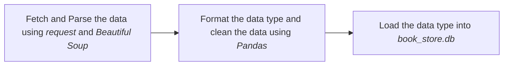
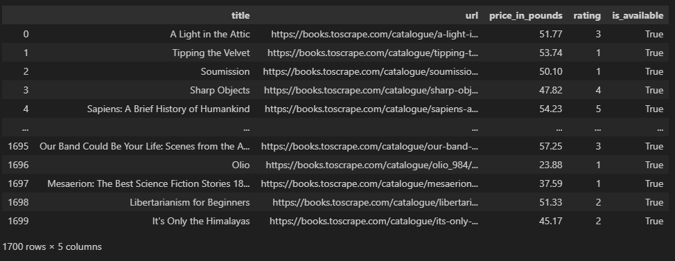

# Simple Data Scraping From A Bookstore

This is a simple end-to-end ETL project about a scraping data from a [bookstore](https://books.toscrape.com) and store the data to an ```SQLite``` database.

This project build on ```Python``` scripts, mainly using ```request``` and [```Beautiful Soup```](https://beautiful-soup-4.readthedocs.io/en/latest/) library to pull and parse the ```HTML``` of the web pages. ```Pandas``` is used to clean and organize the data before submit it to the database.

## Workflow



## Data sample


*Data sample (book_df/master_books table)*
